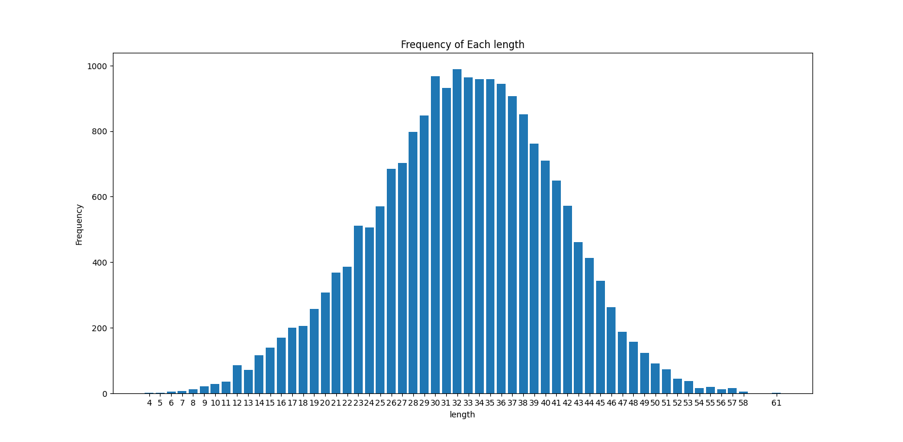
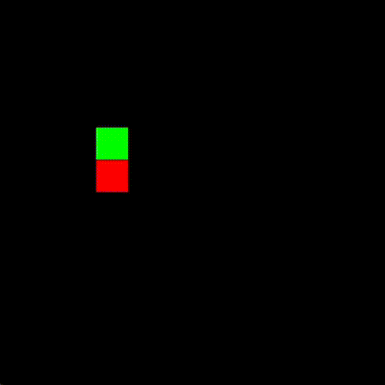

# Reinforcement Learning Snake AI

## Introduction

In this project, I built a reinforcement learning environment to teach a Neural Network to play the game of Snake, through Reinforcement Learning.
Specifically, <b>I used Q-Learning as RL algorithm.</b>
<br>
<b>The entire code is written in pure C++, without the use of any ML libraries.</b>
<br>
The code is in the 'coding' folder, while in the src there are some SFML dipendencies (the library I used for graphics).

## Training
To train the network, I used an <b>epsilon-greedy policy</b> (also known as curiosity based exploration): we set a value epsilon between 0 and 1, and this is the probability of choosing a random action, instead of the best one that the network suggests. This way, we can explore the environment more and learn faster, especially in the initial steps of the training.
<br>
I also used the <b>Adam optimizer paired with backpropagation</b>, which resulted in a more controlled convergence.
<br>
The netowrk I used consists of:
-  9 inputs
- One hidden layer with 100 neurons
- One hidden layer with 50 neurons
- The output layer with 3 neurons (for left, forward and right actions).
<br>

As for the reinforcement technique, the rewards I give to the network (or snake, if you prefer) are:
- -10 if the snake dies
- -0.1 for each time step
- +1 if the snake eats an apple

It's amazing to see how from this simple immediate rewards the network is able to refine a more complex and long term policy.


## Results
The results are promising, and they would probably be even better with some more training.
The network played roughly 3,000,000 games, reaching a best score of 64 on training. While the number of games may seem like a lot, it's actually not that much, and I encourage you to try and train your own network by running more games, if you can!
<br>
I also run about 10000 games of playing to have a estimate of the score distribution, and this is the result:
<br>


<br>
As you can see, the average is around 35, which I'm happy with, considering that it could be trained a lot more.
<br>
Now take a look at an example of game:
<br><br>




## How to use
To use this project, you can clone it and build the executable using this command: 
```
git clone https://github.com/GiacomoPorpiglia/RL-snake-from-scratch
cd RL-snake-from-scratch
make clean
make
```

To execute, there are several flags to choose several network parameters and more:
- --mode : (required) The possible values are 'train' and 'play'. If train, you will train the network (a new or an existing one), if play, you can watch an existing network play.
- --epsilon : The possible values are float between 0 and 1. It sets the starting epsilon value for epsilon-greedy policy (default: 0.2).
- --learnrate : The possible values have to be greater than 0. It sets the learning rate for the nwteork (default: 0.001)
- --batchsize : The possible values are integers greater than 0. It sets the batch size for the training (default: 64)
- --path : (required) The path, relative or absolute, of where you want to save or load the network. Automatically, if in that path a network already exists, it will be loaded. If not, a new network will be initialized.

Some examples of usage are:

```
.\RLsnake.exe --mode play --path ./net
```
or 
```
.\RLsnake.exe --mode train --epsilon 0.1 --learnrate 0.001 --batchsize 64 --path ./net
```


